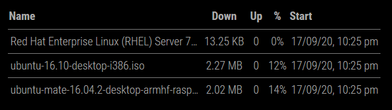

# MMM-qnapDownloadStation
A module for the MagicMirror project (https://github.com/MichMich/MagicMirror) to display the downloads of the QNAP Download Station 

Columns, and headings, as well as how some of the data is displayed is configurable and the inside icon are configurable.



## Installation

Clone this repository in your `~/MagicMirror/modules/` folder `( $ cd ~MagicMirror/modules/ )`:
```
git clone https://github.com/flick116/MMM-qnapDownloadStation
```
## Dependencies

[request](https://www.npmjs.com/package/request)

## Config

|Option|Required|Description|
|---|---|---|
|`username`|Yes|This is your QNAP Download Station username.<br><br> **Type:** `string`|
|`password`|Yes|This is your QNAP Download Station password.<br><br> **Type:** `string`|
|`qnapServer`|Yes|The web address to your QNAP NAS, in the format http://xx.xx.xx.xx or http://servername<br><br> **Type:** `string`|
|`loginUrl`|No|Sets the login URL used as part of the login process, if different from the default.<br><br> **Type:** `string`<br> **Default value:** `/downloadstation/V4/Misc/Login`|
|`queryUrl`|No|Sets the query URL used as part of the login process, if different from the default.<br><br> **Type:** `string`<br> **Default value:** `/downloadstation/V4/Task/Query`|
|`status`|No|Dictates what type of downloads are shown in the table.<br><br>**Type:** `string`<br> **Possible values:** `downloading`, `seeding`, `finished`, `paused`, `stopped`, `completed`, `active`, `inactive`, `all` <br> **Default value:** `downloading`|
|`fromNo`|No|The download to start from, so if you set to 10 it will show from the 10th record.<br><br> **Type:** `string`<br> **Default value:** `0`|
|`limit`|No|Determines the maximum number of downloads to show.<br><br> **Type:** `string`<br> **Default value:** `50`|
|`useHeader`|No|Whether to show the table header.<br><br> **Type:** `bool`<br> **Possible values:** `true` or `false`<br> **Default value:** `true`|
|`headerName`|No|Sets the header column for the download name.<br><br> **Type:** `string`<br> **Default value:** `Name`|
|`headerDownRate`|No|Sets the header column for the download rate.<br><br> **Type:** `string`<br> **Default value:** `Down`|
|`headerUpRate`|No|Sets the header column for the upload rate.<br><br> **Type:** `string`<br> **Default value:** `Up`|
|`headerProgress`|No|Sets the header column for the progress.<br><br> **Type:** `string`<br> **Default value:** `%`|
|`headerStartTime`|No|Sets the header column for the start time/date.<br><br> **Type:** `string`<br> **Default value:** `Start`|
|`showDownRate`|No|Determines whether to show the download rate column.<br><br> **Type:** `bool`<br> **Possible values:** `true` or `false`<br> **Default value:** `true`|
|`showUpRate`|No|Determines whether to show the upload rate column.<br><br> **Type:** `bool`<br> **Possible values:** `true` or `false`<br> **Default value:** `false`|
|`showStartTime`|No|Determines whether to show the start/date time column.<br><br> **Type:** `bool`<br> **Possible values:** `true` or `false`<br> **Default value:** `false`|
|`showProgress`|No|Determines whether to show the progress column.<br><br> **Type:** `bool`<br> **Possible values:** `true` or `false`<br> **Default value:** `false`|
|`dateFormat`|No|Sets the date/time format of date/time columns.<br><br> **Type:** `string`<br> **Possible values:** See https://momentjs.com/<br> **Default value:** `DD/MM/YY, h:mm a`|


Example of the config.js entry:

```
		{
			module: "MMM-qnapDownloadStation",
			header: "QNAP Download Station",
			position: "top_right",
			config: {
				username: "admin",
				password: "password"
			},
		},
```